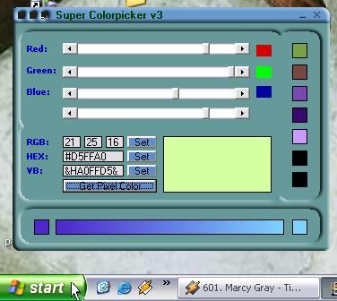



## A Super Colorpicker V3

### Description

With this colorpicker you can create colors using a Red, Green and Blue Bar (RGB). And get/set a HEX, RGB and VB colorcode or convert one to another. You can grab any color of the screen and use it, so you can get a color of a website without looking in the code. It's possible to make the color lighter or darker. Now added 7 saveslots, just drag the color to them and double click them to get the color back. There is also a color gradient to make a gradient between 2 colors. Please vote and all comments are welcome.
 
### More Info
 

             |
---                |---
**Submitted On**   |2003-11-28 01:10:58
**By**             |[Wwward](https://github.com/Planet-Source-Code/PSCIndex/blob/master/ByAuthor/wwward.md)
**Level**          |Advanced
**User Rating**    |5.0 (15 globes from 3 users)
**Compatibility**  |VB 6\.0
**Category**       |[Graphics](https://github.com/Planet-Source-Code/PSCIndex/blob/master/ByCategory/graphics__1-46.md)
**World**          |[Visual Basic](https://github.com/Planet-Source-Code/PSCIndex/blob/master/ByWorld/visual-basic.md)
**Archive File**   |[A\_Super\_Co16772711282003\.zip](https://github.com/Planet-Source-Code/wwward-a-super-colorpicker-v3__1-50172/archive/master.zip)

